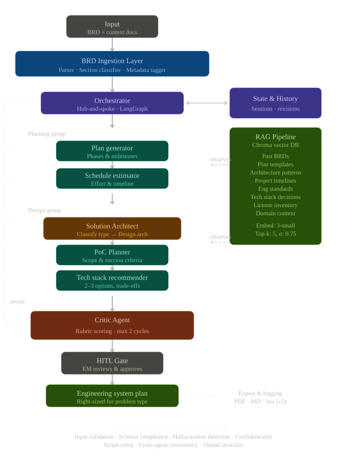

# Runtime Topology — v2



---

## Flow summary

1. **Input** — A BRD, PRD, or RFC document (PDF, DOCX, or Markdown) plus optional context docs.

2. **BRD Ingestion Layer** — Three sequential steps: a format-agnostic parser extracts raw text; a section classifier (GPT-4o-mini) splits the document into typed sections (objective, requirements, constraints, risks, etc.); a metadata tagger (GPT-4o-mini) derives doc type, domain, complexity, and problem type.

3. **Orchestrator** — LangGraph hub-and-spoke graph. Manages routing between agent groups, drives the critic revision loop, and holds bidirectional sync with the State & History Store (SQLite checkpointer tracking sessions and revision history).

4. **Planning group** — Two sequential agents:
   - **Plan Generator** — Produces phases and milestones from the parsed BRD.
   - **Schedule Estimator** — Derives effort estimates and a week-by-week timeline.

5. **Design group** — Three agents, ordered:
   - **Solution Architect** — First classifies the problem type (`greenfield | migration | integration | poc | enhancement`), then produces a high-level architecture design. Problem type classification gates the PoC Planner branch.
   - **PoC Planner** *(conditional — runs only when problem type is `poc`)* — Defines scope, success criteria, and out-of-scope boundaries.
   - **Tech Stack Recommender** — Proposes 2–3 technology options with trade-off analysis.

6. **RAG Pipeline** — Chroma vector DB (`text-embedding-3-small`, top-k=5, cosine similarity threshold 0.75). Both Planning and Design agent groups retrieve from it. Contains 8 source types: past BRDs, plan templates, architecture patterns, project timelines, engineering standards, tech stack decisions, license inventory, domain context.

7. **Critic Agent** — Scores all outputs against a 5-dimension rubric (completeness, feasibility, specificity, consistency, scope fit). If the overall score falls below the pass threshold, routes back to the Orchestrator for a revision pass. Maximum 2 revision cycles.

8. **HITL Gate** — LangGraph `interrupt()` pause point. An engineering manager reviews the assembled plan and approves or rejects. Rejection terminates the graph; approval proceeds to output assembly.

9. **Engineering System Plan** — Final structured output right-sized for the classified problem type (a full system design for greenfield/migration; a lighter PoC plan for poc type). Optionally exported to PDF, Markdown, or Jira (v2 roadmap).

10. **Guardrails** — Cross-cutting enforcement applied at every boundary: input validation, prompt injection detection, schema compliance on agent outputs, hallucination marker checks, scope creep detection, cross-agent consistency.

---

## Agent models

| Agent | Model | Reason |
|---|---|---|
| Orchestrator | gpt-5.4| Routing decisions require full reasoning |
| Solution Architect | gpt-5.4 | Classification + architecture design is the most demanding step |
| Critic | gpt-5.4 | Rubric scoring needs nuanced judgment |
| Plan Generator | gpt-5.4 | Multi-phase planning from ambiguous requirements |
| Schedule Estimator | gpt-5.4-mini | Structured arithmetic given clear phase inputs |
| PoC Planner | gpt-5.4-mini | Constrained, well-defined output format |
| Tech Stack Recommender | gpt-5.4-mini | Retrieval-augmented comparison, structured output |

---

## State transitions

```
START
  └─► ingest
        └─► plan_generator
              └─► schedule_estimator
                    └─► solution_architect
                          ├─► poc_planner (if problem_type == "poc")
                          │     └─► tech_stack_recommender
                          └─► tech_stack_recommender (otherwise)
                                └─► critic
                                      ├─► plan_generator (if score < threshold AND revisions < 2)
                                      └─► hitl
                                            ├─► output ──► END
                                            └─► END (rejected)
```

---

## What is not shown

- **Eval harness** — An offline evaluation system will score final engineering plans against ground-truth rubrics using the sample Verdant Intelligence BRDs. This is a separate pipeline, not part of the runtime graph.
- **Embedding pipeline for new documents** — Adding documents to the RAG knowledge base is a one-time seed operation (`rag/seed.py`), not part of the live inference path.
